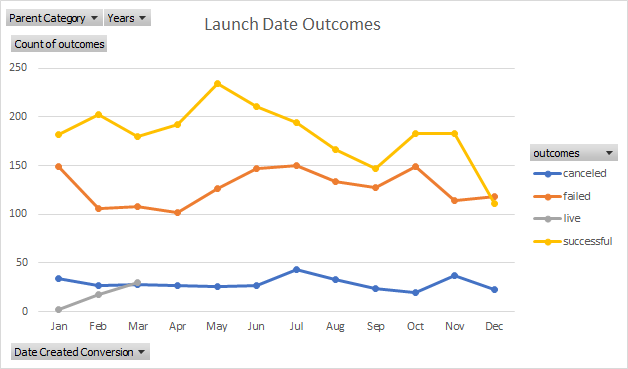
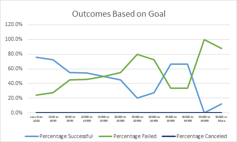

# An Analysis of Kickstarter Campaigns
Performing analysis on Kickstarter data to uncover trends.

This project takes kickstarter data and analyzes it to help Louise(a play writer) have the best odds in achieving her campaign goal and making her play a reality.

##Findings:
 1. Best month to launch Campaign May
 
 
 
 2. based on the plays she loved the average donations were $40
 3. The mean Goal for successful campaigns was 5,000 compared to 10,000 for failed ones, inferring that failed campaigns tend to have higher goals.

###Recomendations:
Adjust play budget to 5,000 since its a reasonable goal based on the data. Most succesful campaigns started in May and lasted around a month, but if may isnt possible June and July are also good months to strive for. Absolutely avoid trying to start campaign in October, most failed campigns started this month.

# Kickstarting with Excel

## Overview of Project

    Louise’s fundraising campaign for her play Fever received great support in a short period of time. This led her to wonder how different campaigns perform relative to their launch dates and their funding goals. 

### Purpose
    The pupose of this challenge was to use the Kickstarter data to visualize campaign outcomes based on their launch dates and their funding goals.

## Analysis and Challenges

### Analysis of Outcomes Based on Launch Date
    I started by creating a pivot table from the data we already had in the Kickstarter sheet.I had the pivot table include theather campaings that were successful, that had failed, that were canceled and organized these campaigns by month. I then took this information and created a line chart because we're dealing with time and this helped me see which months had the most successful campaigns.

### Analysis of Outcomes Based on Goals
    I started by creating a new sheet and writing down the goal range amounts in column A. I then used the COUNTIFS formula to get more specific with the data and be able to seperate the successful,failed and canceled campaigns based on the goal ranges I had set in column A. After filtering out that data I used the SUM formula to get the total for every goal range. Next I took all the information i had and created the percentages of successful,failed, and canceled campaigns. Lastly I took my data collected and put it into a line chart to be able to understand more easily the relationship between the goal ranges and the percentage of succesful,failed and canceled campaigns

    
### Challenges and Difficulties Encountered
    The challenges I encountered in the project can all be traced back to mispelling,switching up or missing letters and numbers.

    One specific challenge I had was when i was using COUNTIFS to get the number of successful plays between 30000 to 34999.
    My error was writing 30000 to 24999 instead of 30000 to 34999 so when i did the calculation i got a 0 instead of a 3. At the moment i didnt know that was the issue but i did know there was an error because in the video it showed us how to check our numbers by adding up the number successful column and comparing it to this command  =COUNTIFS(Kickstarter!F:F, "successful", Kickstarter!D:D,">0", Kickstarter!R:R,"plays")

    Other challenges I had were just forgetting simple things like how to switch and answer from being 2 decimal points to 1 but that has an easy fix since i just googled it.
## Results

    - What are two conclusions you can draw about the Outcomes based on Launch Date?
        1. The best month to Launch a campaign is in May
        2. The worst month to launch a campaign is in October

    - What can you conclude about the Outcomes based on Goals?
        Highest rate (75%) of successful campaigns was when their goal was less than 1000 but second highest (72%) was when ther goal was between 1000 and 4999. Therefore we can conclude that for a higher succes rate we set a goal less than or equal to 5000.
    - What are some limitations of this dataset?

    - What are some other possible tables and/or graphs that we could create?
